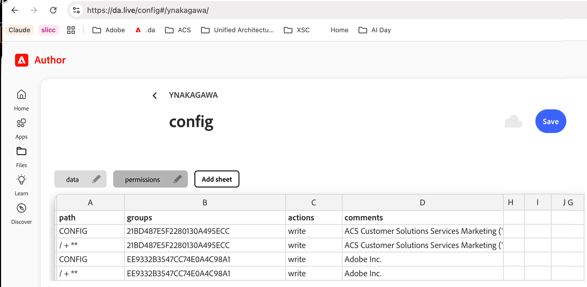

# Sync Content from da-demo-kit to Your DA Repo

Automatically populate your target DA repo with complete default configuration from `ynaka-adobe/da-demo-kit`, including all config sheets and integration credentials.

## What Gets Synced

**Full Configuration:**
- **data** — Tool configuration (Send to Adobe Target, Send to Marketo, Change Target Offer, Send for Approval)
- **library** — Blocks, Templates, Icons, Generate Variations, Adobe Target, Adobe Workfront, CMC Management Tool
- **apps** — Content Syndication, Site Creator, Demo App
- **prepare** — Preparation workflow configuration

**Credentials & Config:**
- `.da/adobe-target.json` — Adobe Target clientId, clientSecret, tenant
- `.da/adobe-workfront.json` — Adobe Workfront configuration
- `metadata.json` — Site metadata
- `.da/aem-permission-requests.json` — Permission request templates

## Prerequisites

Your target DA repo must already be connected to your Claude instance. If you haven't done this yet, run the `eds-readiness` playbook first to set up your environment.

## One-time setup: authorize config writes (per target org)

Config sheets are written with a **`PUT` to `admin.da.live/config`**, which needs an **IMS Bearer token**. A helix
Site Admin key does **not** work here — different auth realm (verified: it returns **401** on `admin.da.live`). So
each target org authorizes config writes once, using an **IMS Server-to-Server (S2S)** identity granted `write` in
the org's DA **`permissions`** sheet:

1. Create an **IMS S2S** credential in the Adobe Developer Console (one time, reused across orgs).
2. In the **target org's** `da.live/config` → **`permissions`** sheet, add **four rows** granting `write` to **both
   IMS orgs** the sync identity resolves through, then **Save**:

   | path | groups | actions | comments |
   |---|---|---|---|
   | `CONFIG` | `21BD487E5F2280130A495ECC` | `write` | ACS Customer Solutions Services Marketing (Yuji) |
   | `/ + **` | `21BD487E5F2280130A495ECC` | `write` | ACS Customer Solutions Services Marketing (Yuji) |
   | `CONFIG` | `EE9332B3547CC74E0A4C98A1` | `write` | Adobe Inc. |
   | `/ + **` | `EE9332B3547CC74E0A4C98A1` | `write` | Adobe Inc. |

   **Both** IMS orgs are required (ACS Marketing **and** Adobe Inc.) — one alone is not enough. `groups` holds **IMS
   org IDs**, not emails. This exact grant took the live test from **403 → 201**.

   

3. The sync mints a token from the S2S credential and uses it as the Bearer for the config `PUT`.

**Full details (Console steps, token minting, verify step):** see `actions/PROVISIONING.md` in `da-demo-kit`.

> **Content, `.da/*.json`, and `docs/library` don't need this** — they're DA content sources the connector writes
> with your own session. Only the **config store** (data / library / apps / prepare) needs the S2S token.

## How to Use

**Two options:**

These are **Adobe I/O Runtime** actions (on `adobeioruntime.net`) — **not** the EDS site. The `…hlx.live/actions/…`
URLs are dead (that domain is deprecated/blocked; EDS sites don't front I/O Runtime).

### Option 1: Full Config Sync (Recommended)
Syncs all default configuration in one call:
```
https://332794-dademokitappbuilder.adobeioruntime.net/api/v1/web/da-demo-kit/sync-config?targetOrg=your-org&targetRepo=your-site
```

### Option 2: Individual Sheet Sync
Sync specific sheets as needed:
```
https://332794-dademokitappbuilder.adobeioruntime.net/api/v1/web/da-demo-kit/sync-da-sheet?targetOrg=your-org&targetRepo=your-site&sheetPath=.da/adobe-target.json
```

> **Runtime env required:** the action returns `401 "Missing authentication"` until **`ADMIN_API_KEY`** is set on the
> da-demo-kit App Builder runtime (so it can read `DA_Token` from `.da/adobe-da`) — or the IMS S2S vars as fallback.
> Verified live: with no env set, the deployed action returns exactly that 401.

> ⚠️ **These endpoints are Adobe I/O Runtime actions — they only work if the action is *deployed and reachable*.**
> EDS content sites don't serve `/actions/…` by default. If they return **404**, the action isn't deployed (see
> Troubleshooting) — use the **interim direct method** below to complete the config sync without the action.

## Interim: direct config sync (no action) — maintainer only

Use this when the `sync-config` action is down/404 and you (the maintainer) have the source **`DA_Token`**. It does
exactly what the action does, from the command line. *End users can't use this — they don't have `DA_Token`; they
rely on the deployed action.*

Prereqs: the target org's `permissions` sheet grants the two IMS orgs `write` (above), and `DA_Token` is in an env
var / file — **never pasted into chat**.

```bash
# DA_TOKEN in a file (e.g. from the .da/adobe-da sheet); never echo it
DA=$(cat ~/.aem/da_token)
# 1. read da-demo-kit config; 2. PUT it to the target site
curl -sf -H "Authorization: Bearer $DA" \
  https://admin.da.live/config/ynaka-adobe/da-demo-kit/ > /tmp/src-config.json
curl -sf -X PUT -H "Authorization: Bearer $DA" \
  --data-urlencode "config@/tmp/src-config.json" \
  https://admin.da.live/config/<owner>/<site>/
rm -f /tmp/src-config.json
```
A **201/200** = config synced. A **403** = the target org is missing the permissions grant (fix that first).
*(This is the exact flow validated live: 403 → 201.)*

## Web UI Alternative

Navigate to the `sync-content` page on da-demo-kit's **current** domain (the `hlx.live` one is dead):
`https://main--da-demo-kit--ynaka-adobe.aem.page/sync-content` (or `.aem.live` once published)

Fill in:
- **Organization** — your GitHub org
- **Repository** — your site name
- **What to Sync** — Full Config or Single Sheet

## After Sync

Your target repo will have:
- ✅ All config tabs ready in DA workspace
- ✅ Target and Workfront credentials configured
- ✅ Library sheets with blocks, templates, icons
- ✅ App integrations ready to use

View your config at: `https://da.live/config#/your-org/your-site/`

## Troubleshooting

| Problem | Solution |
|---------|----------|
| "Access denied" | Confirm you have write access to the target DA repo |
| Config tabs not showing | Hard refresh (Cmd+Shift+R) the DA config page |
| Credentials sheet empty | Verify the source sheets exist in da-demo-kit |
| Action returns 401 (config PUT) | The config write needs an **IMS S2S** Bearer, and the target org's `permissions` sheet must grant that identity `write` on `CONFIG` — see "One-time setup" above. A helix Site Admin key won't work here. |
| DA MCP failing / `da_*` tools erroring or hanging / "server disconnected" | **Disconnect the AEM DA connector and reconnect it** (claude.ai connector settings, or `/mcp` in an interactive terminal), then retry. A stale/expired connection is the usual cause. |
| **`/actions/sync-config` (or `/sync-content`) returns 404** | The I/O Runtime action **isn't deployed/reachable** — EDS sites don't serve `/actions/…` by default. **Deploy it:** `aio app deploy` the `actions/` from da-demo-kit to your I/O Runtime namespace, set env (`ADMIN_API_KEY`, etc.), then point this skill's URLs at the real `…adobeioruntime.net/api/v1/web/…` endpoint. **To unblock now:** use the **interim direct method** above (maintainer + `DA_Token`). |

## Next Steps

- **View your config:** `https://da.live/config#/your-org/your-site/`
- **Use the credentials:** Reference sheets in your DA content or integrations
- **Customize:** Edit sheets in DA UI to customize for your needs

## API Reference

**Endpoint:** `https://admin.da.live/config/{org}/{repo}/`

**Method:** PUT

**Auth:** IMS Bearer token — from an S2S technical account granted `write` in the org's `permissions` sheet (see "One-time setup"). Not a helix Site Admin key.

**Payload:** Config JSON structure from source

See `SYNC_README.md` in da-demo-kit for complete API documentation.
